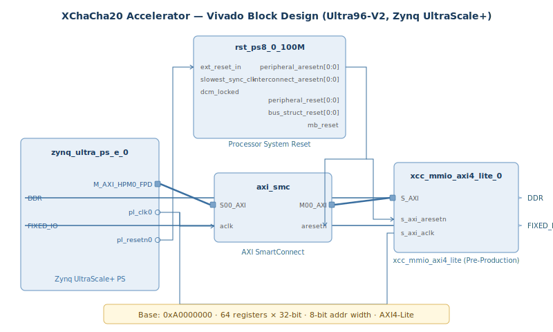

# XChaCha20 Hardware Accelerator — FPGA Integration on Zynq UltraScale+

An FPGA-based hardware accelerator for the XChaCha20 stream cipher, deployed on an Avnet Ultra96-V2 (Xilinx Zynq UltraScale+ xczu3eg) as part of Georgia Tech's [CRNCH Rogues Gallery](https://crnch-rg.cc.gatech.edu/) testbed.

This repository contains the synthesized bitstream and hardware handoff files for the accelerator's SoC integration. The XChaCha20 cipher RTL was developed collaboratively within the **Future Computing with Rogues Gallery** Vertically Integrated Project (VIP) at Georgia Tech. My work focused on **IP creation and packaging, Vivado block design construction, and full design flow execution** — taking the standalone cipher logic and turning it into a deployable SoC peripheral.

## System Architecture



### Design Overview

The accelerator is implemented as a custom AXI4-Lite peripheral on the Zynq UltraScale+ programmable logic (PL), interfaced to the ARM processing system (PS) for software-driven encryption and decryption.

| Component | Description |
|---|---|
| **Target Board** | Avnet Ultra96-V2 (xczu3eg-sbva484-1) |
| **Toolchain** | Xilinx Vivado 2025.1 |
| **PL Clock** | 100 MHz (pl_clk0) |
| **Bus Protocol** | AXI4-Lite (32-bit data, 8-bit address) |
| **Register File** | 64 memory-mapped registers at base address `0xA0000000` |
| **IP Instance** | `xcc_mmio_axi4_lite_0` (xilinx.com:user:xcc_mmio_axi4_lite:1.0) |

### Block Design Modules

- **zynq_ultra_ps_e_0** — Zynq UltraScale+ Processing System. Provides the AXI4 master interface (M_AXI_GP0) for register reads/writes to the accelerator, along with the PL clock (FCLK_CLK0) and reset signals.
- **axi_smc** — AXI SmartConnect. Protocol bridge converting full AXI4 transactions from the PS master into AXI4-Lite for the accelerator's slave interface.
- **xcc_mmio_axi4_lite_0** — Custom XChaCha20 accelerator IP. Exposes 64 × 32-bit MMIO registers for key material, extended nonce (192-bit), counter, plaintext input, and ciphertext output. Software writes configuration and data, triggers the cipher operation, and reads results back — all over memory-mapped I/O.
- **rst_ps8_0_100M** — Processor System Reset. Generates synchronized active-low reset (`peripheral_aresetn`) for the PL clock domain.

### Data Flow

1. Software running on the ARM core writes the 256-bit key, 192-bit nonce, and block counter into the accelerator's MMIO registers via AXI4-Lite.
2. Plaintext data is written into the data input registers.
3. The accelerator performs the XChaCha20 cipher operations in hardware (HSubKey derivation → ChaCha20 block function with modified nonce).
4. Ciphertext is read back from the output registers.

The extended 192-bit nonce is what distinguishes XChaCha20 from standard ChaCha20 — it allows for safe random nonce generation without collision risk, which is important for high-throughput encryption scenarios.

## Repository Contents

```
├── README.md
├── bitstream/
│   ├── design_1_wrapper.bit    # FPGA bitstream (synthesized & implemented)
│   └── design_1.hwh            # Hardware handoff (block design metadata)
└── docs/
    └── block_diagram.svg       # System architecture diagram
```

### Files

- **`design_1_wrapper.bit`** — The compiled FPGA bitstream ready for deployment on the Ultra96-V2. Generated through Vivado synthesis and implementation.
- **`design_1.hwh`** — XML-based hardware handoff file describing the full block design: module instances, AXI address maps, port connections, clock frequencies, and IP parameters. Used by PYNQ or Petalinux for overlay loading and driver generation.

## My Contributions

This project was part of the Reconfigurable Computing subteam within the VIP. The core cipher RTL (quarter-round operations, column/diagonal rounds, state matrix management) was a collaborative team effort. My work covered the full **IP integration and FPGA deployment pipeline**:

### IP Creation & Packaging
- Used Vivado's *Create and Package IP* wizard to generate a new AXI4 Peripheral, configuring the register count (64), bus mode (AXI4-Lite), and interface type (slave).
- Removed the auto-generated placeholder Verilog logic while preserving the top-level module and AXI bus interface.
- Integrated the team's XChaCha20 Verilog sources into the IP core and instantiated the cipher wrapper (`xcc_axi4_lite`) within the top-level module, mapping cipher I/O to the AXI register file.
- Packaged the complete IP for reuse within Vivado's IP catalog.

### Block Design Construction
- Created the SoC block design from scratch — instantiated the packaged XChaCha20 IP alongside a Zynq Processing System.
- Ran Vivado's connection automation to generate the AXI SmartConnect bridge and reset infrastructure, then configured the PL clock frequency in the Zynq PS configuration wizard.
- Validated design connectivity through Vivado's design rule checks (DRC).

### Synthesis & Deployment
- Executed the full Vivado design flow (synthesis → implementation → bitstream generation) on Georgia Tech's CRNCH Rogues Gallery flubber compute nodes.
- Produced the final `.bit` and `.hwh` artifacts for deployment on the Ultra96-V2 FPGA board within the CRNCH testbed.

## Build Environment

All work was performed on the CRNCH Rogues Gallery Open OnDemand cluster:
- **Access:** [rg-ood.crnch.gatech.edu](https://rg-ood.crnch.gatech.edu/)
- **Compute nodes:** flubber1, flubber4, flubber5, flubber8, flubber9
- **Vivado path:** `/tools2/reconfig/xilinx/2025.1/Vivado/bin/vivado`

## Context

This work was conducted as part of **Future Computing with Rogues Gallery**, a Vertically Integrated Project (VIP) exploring post-Moore hardware architectures. The CRNCH (Center for Research into Novel Computing Hierarchies) Rogues Gallery provides access to non-traditional hardware platforms for research, including FPGAs, neuromorphic processors, and near-memory computing systems.

**Note:** The full RTL source and testbenches are maintained in the team's private repository. This repo serves as a public-facing overview of the IP integration and deployment work.

## Technologies

Vivado 2025.1 · Verilog / SystemVerilog · AXI4-Lite · Zynq UltraScale+ · FPGA · Ultra96-V2 · CRNCH Rogues Gallery

## Related

- [CRNCH Rogues Gallery](https://crnch-rg.cc.gatech.edu/)
- [XChaCha20 (IETF Draft)](https://datatracker.ietf.org/doc/html/draft-irtf-cfrg-xchacha)
- [Ultra96-V2 Documentation](https://www.avnet.com/wps/portal/us/products/avnet-boards/avnet-board-families/ultra96-v2/)
